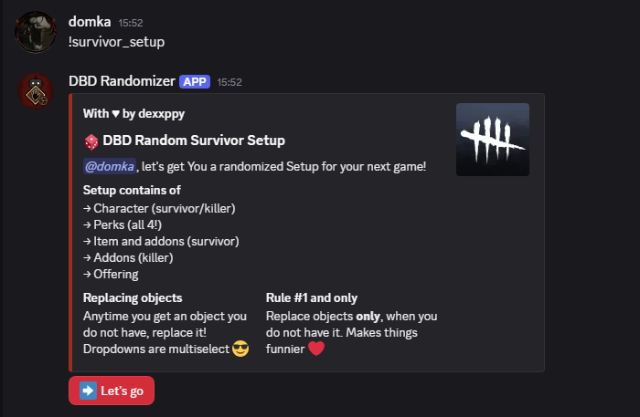
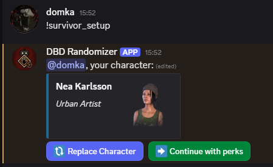
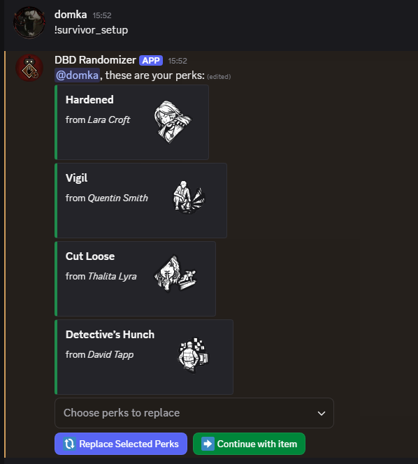
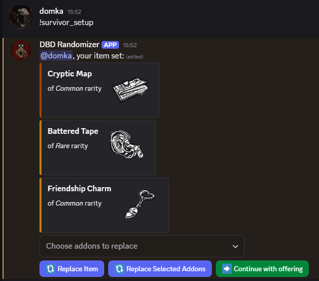
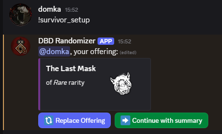
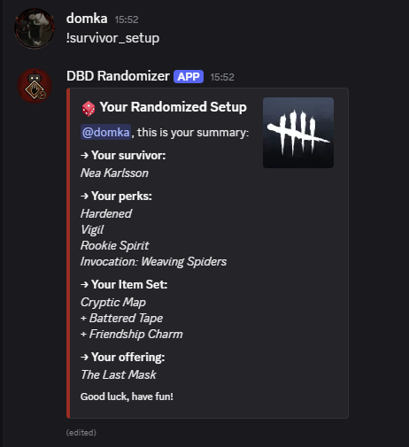
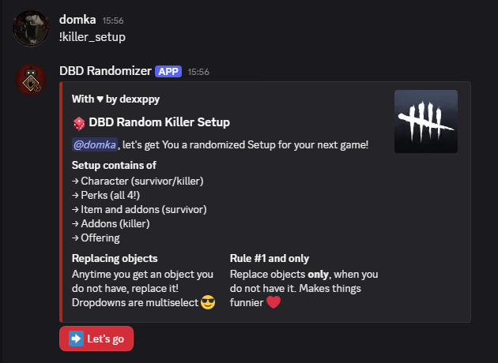
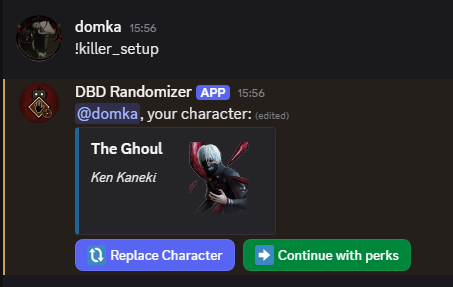
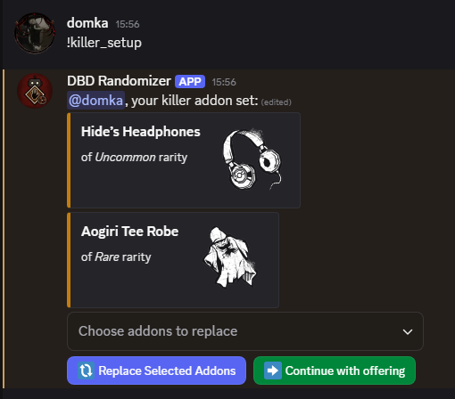
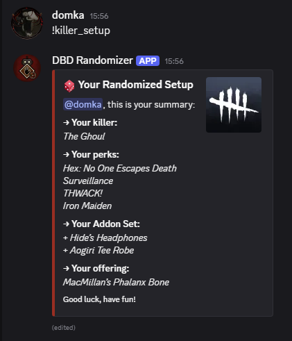

# 🎲 Dead by Daylight Random Perks Bot

A Discord bot that helps you randomly select Dead by Daylight setups for Killers and Survivors — perfect for challenges, custom games, or just for fun!  
Users can roll perks, items, oferrings, or whole setups, select which ones they want to replace, and reroll with a single button click.
Game data is scraped using Selenium for up-to-date values (https://www.unwrittenrulebook.com).

## Add the bot to your Discord Server!
Bot is actively deployed on server and ready to use! Paste the link below in your browser, log in to discord, select your server and give necessary permissions(all selected). Authorise and enjoy! 
- [https://discord.com/oauth2/authorize?client_id=1401135973974282290&permissions=549755841536&integration_type=0&scope=applications.commands+bot](https://discord.com/oauth2/authorize?client_id=1401135973974282290&permissions=549755841536&integration_type=0&scope=applications.commands+bot)
- https://top.gg/bot/1401135973974282290 

## ✨ Features

- `!killer` – Get random Killer character
- `!survivor` – Get random Survivor character
- `!killer_offering` – Get random Killer offering
- `!survivor_offering` – Get random Survivor offering
- `!item` – Get random Survivor item + addons
- `!killer_perks` – Get random Killer perks
- `!survivor_perks` – Get random Survivor perks
- `!killer_setup` – Get random Killer setup (including character, perks, addons and offering)
- `!survivor_setup` – Get random Survivor setup (including character, perks, item+addons and offering)
- Interactive UI: select objects you want to replace
- Re-randomization logic with exclusions to avoid repeats
- Clean, embedded UI
- Up-to-date objects (characters, perks..) thanks to scrapers

## 📁 Project Structure
<pre lang="markdown"> 
``` 
  dbd-random-perks-discord-bot/ │ 
  ├── data/ # JSON files with DBD objects data
  │ ├── killers.json
  │ ├── perks.json
  │ └── ... 
  ├── core/ # Python utility functions
  │ ├── data_funcs.py # Handles mapping objects 
  │ ├── randomize_funcs.py # Randomization logic
  │ ├── data_loader.py # Handles ingesting data from files
  │ └── state.py # Storing of user's drawn objects
  ├── scrapers/ # Python+Selenium scrapers
  │ ├── modules/ # Scrapers for specific objects
  | | ├── item_scraper.py
  | | ├── perk_scraper.py
  | │ └── ...
  │ ├── base_scraper.py # Base class for all scrapers
  │ └── run_scrapers.py # Entry point of scrapers
  ├── utils/
  │ └── views_utils.py # Utilities for View objects
  ├── views/
  │ ├── modules/ # Views for drawing specific objects
  | │ ├── character_randomize_view.py
  | │ ├── item_randomize_view.py
  | │ ├── killer_addons_randomize_view.py
  | │ ├── offering_randomize_view.py
  | │ └── perks_randomize_view.py
  │ ├── randomize_view.py # Base class for all object views
  │ ├── start_setup_view.py # Initial view for setup randomizing, explains rules
  │ └── final_setup_view.py # Final view for setup randomizing, randomization summary
  ├── bot.py # Bot entry point 
  ├── commands.py # Definition of bot commands 
  ├── requirements.txt # Libraries used by program
  ├── .env.example # Environment variables, contains bot token and webdriver path (rename to .env and insert your values)
  └── README.md # You're here! 
```
</pre>

## 💾🔧 Prerequisites for Scrapers
- **Python** 3.9+
- **Google Chrome** (latest stable version)
- **ChromeDriver** matching your chrome version

## 💾🛠️ Scrapers Setup Instructions

### 1. Clone the repository

```bash
git clone https://github.com/dexxppy/dbd-random-perks-discord-bot.git
cd dbd-random-perks-discord-bot
```
### 2. Install dependencies
```bash
pip install -r requirements.txt
```
(Make sure you’re using Python 3.9+)

### 3. Environmental variables
Edit .env file, replace CHROMEDRIVER_PATH with path to your ChromeDriver software.

### 4. Run the scraper
In project folder terminal, run:
```bash
python -m scrapers.run_scraper
```
Scraped data will be saved to data folder in respective JSON files.

## 🤖🔧 Prerequisites for Bot
- **Python** 3.9+

## 🤖🛠️ Bot Setup Instructions

### 1. Clone the repository

```bash
git clone https://github.com/dexxppy/dbd-random-perks-discord-bot.git
cd dbd-random-perks-discord-bot
```
### 2. Install dependencies
```bash
pip install -r requirements.txt
```
(Make sure you’re using Python 3.9+)

### 3. Environmental variables
Create application on https://discord.com/developers/applications and generate bot token. Edit .env file, replace DISCORD_BOT_TOKEN with your bot token.

### 4. Enable privileged intents
Make sure your bot has the "Message Content Intent" enabled in the Discord Developer Portal, under Bot → Privileged Gateway Intents.

### 5. Add your bot to Discord server
Generate bot invite link and follow the steps.

### 6. Run the bot
In project folder terminal, run:
```bash
python bot.py
```

## 📸 Preview
### Random survivor setup
 \
 \
 \
 \
 \
 

### Random killer setup
 \
 \
 \
 \
 

## 📄 License
MIT License. Free to use, modify.

---

Made with ❤️ by dexxppy.

