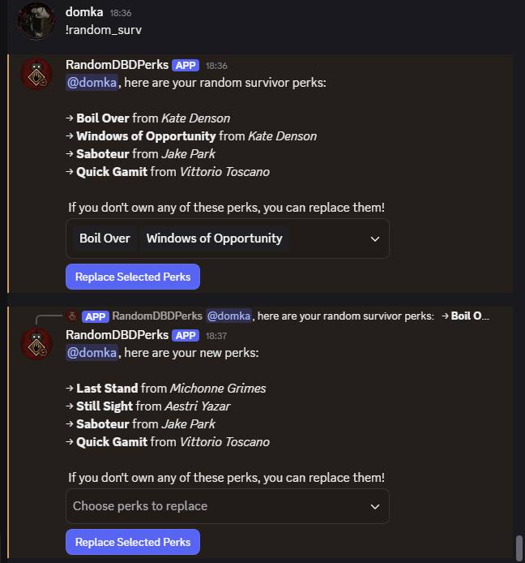
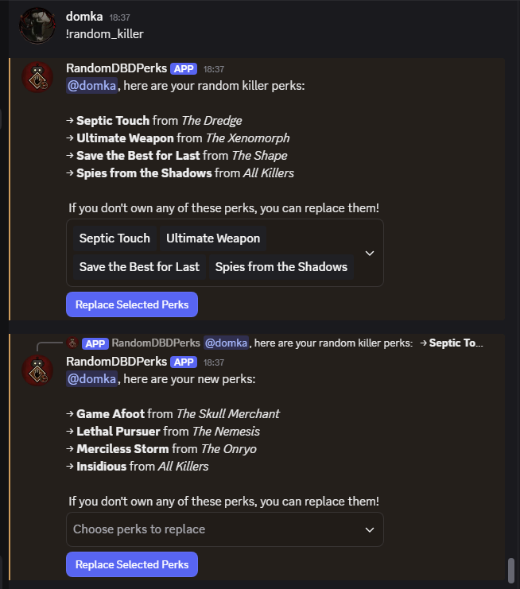

# 🎲 Dead by Daylight Random Perks Bot

A Discord bot that helps you randomly select Dead by Daylight perks for Killers and Survivors — perfect for challenges, custom games, or just for fun!  
Users can roll perks, select which ones they want to replace, and reroll with a single button click.

## Add the bot to your Discord Server!
Paste the link below in your browser, log in to discord, select your server and give necessary permissions(all selected). Authorise and enjoy!
https://discord.com/oauth2/authorize?client_id=1401135973974282290&permissions=11264&integration_type=0&scope=applications.commands+bot

## ✨ Features

- `!random_killer` – Get 4 random Killer perks
- `!random_surv` – Get 4 random Survivor perks
- Interactive UI: select perks you want to reroll
- Re-randomization logic with exclusions to avoid repeats
- Clean, embedded UI
- Timeout after inactivity (default: 5 minutes)

## 📁 Project Structure
<pre lang="markdown"> 
``` 
  dbd-random-perks-discord-bot/ │ 
  ├── data/ # JSON files with perk data 
  │ ├── killers.json
  │ ├── killer_perks.json
  │ └── ... 
  │ ├── funcs/ # Python utility functions
  │ ├── data_funcs.py # Handles mapping perks 
  │ ├── randomize_funcs.py # Randomization logic
  │ └── RandomizeView.py # Discord UI View (Select + Button) 
  ├── main.py # Bot entry point 
  ├── requirements.txt # Libraries used by program
  └── README.md # You're here! 
```
</pre>

## 🛠️ Setup Instructions

### 1. Clone the repository

```bash
git clone https://github.com/dexxppy/dbd-random-perks-discord-bot.git
cd dbd-random-perks-discord-bot
```
### 2. Install dependencies
```bash
pip install -r requirements.txt
```
(Make sure you’re using Python 3.9+)

### 3. Add your bot token
Create application on https://discord.com/developers/applications and generate bot token. Create .env file and insert this line, replace TOKEN with your bot token:
```bash
DISCORD_BOT_TOKEN=TOKEN
```

### 4. Enable privileged intents
Make sure your bot has the "Message Content Intent" enabled in the Discord Developer Portal, under Bot → Privileged Gateway Intents.

### 5. Run the bot
In project folder terminal, run:
```bash
python bot.py
```

## 📸 Preview
### Random survivor perks


### Random killer perks


## 📌 To-Do
- Enable users to get random item and add-ons
- Create an option to randomize full set-up: killer/survivor, perks, add-ons/items_add-ons
- Randomize character's outfit
- Host on a cloud server

## 📄 License
MIT License. Free to use, modify.

---

Made with ❤️ by dexxppy.

